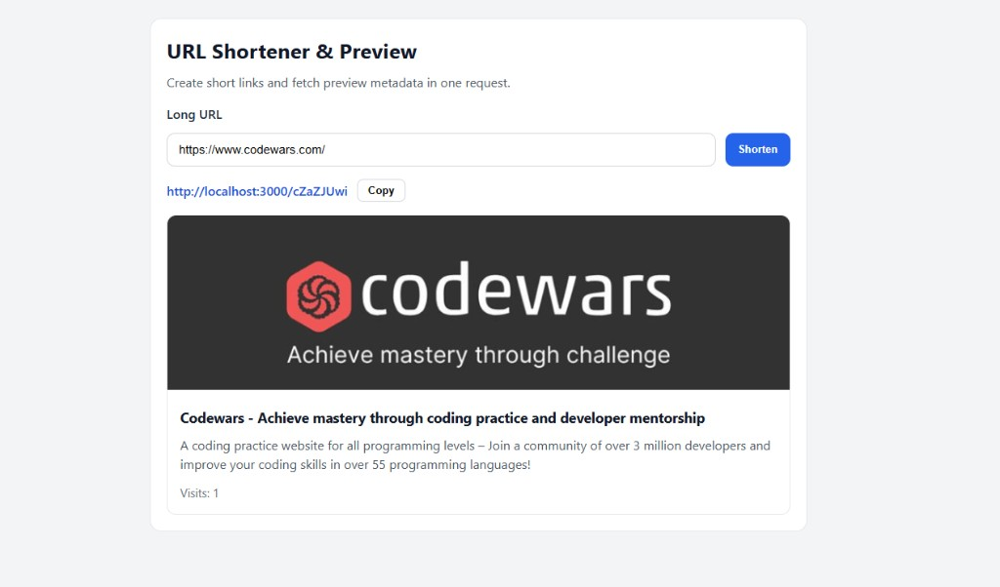

# URL Shortener with Open Graph Preview

Production-style fullstack monorepo for URL shortening with metadata preview extraction.

## UI Preview



## Project Structure

```text
url-shortener/
  backend/
  frontend/
  docker-compose.yml
  README.md
```

## Architecture Overview

- **Backend**: Express + TypeScript service with clean layering (`controllers -> services -> repositories`) and Prisma/SQLite persistence.
- **Frontend**: Vue 3 + Vite + TypeScript with Composition API, component-driven UI, and composable-based business flow.
- **Infrastructure**: Docker multi-stage builds for both apps and Docker Compose orchestration.

### Backend Layering

- `controllers`: HTTP contract only (validation + response formatting).
- `services`: business logic (normalization, OG extraction, cache, shortening flow).
- `repositories`: persistence and DB access through Prisma.
- `middlewares`: request logging, centralized errors, and rate limiting.
- `config`: environment and logger setup.

This split keeps controllers thin and all core behavior testable and reusable.

## Tech Stack

### Backend

- Node.js
- Express
- TypeScript (strict mode)
- Prisma ORM
- SQLite
- nanoid
- axios + cheerio
- zod
- pino + pino-http
- express-rate-limit

### Frontend

- Vue 3
- Vite
- TypeScript
- Composition API
- Axios

### DevOps

- Docker (multi-stage images)
- docker-compose

## API Contract

### `POST /api/shorten`

Creates (or reuses) a short URL for a long URL.

Request body:

```json
{
  "url": "https://example.com/blog/post"
}
```

Response:

```json
{
  "shortUrl": "http://localhost:3000/AbC123xy",
  "preview": {
    "title": "Example title",
    "description": "Example description",
    "image": "https://example.com/cover.jpg"
  },
  "visits": 0
}
```

### `GET /:id`

Resolves the short ID, increments visit counter, and redirects to original URL.

## Local Development

### 1) Backend

```bash
cd backend
npm install
cp .env.example .env
npm run prisma:migrate
npm run dev
```

Backend runs at `http://localhost:3000`.

### 2) Frontend

```bash
cd frontend
npm install
cp .env.example .env
npm run dev
```

Frontend runs at `http://localhost:5173`.

## Prisma Migrations

In `backend`:

```bash
npm run prisma:migrate
```

Useful additional commands:

```bash
npm run prisma:generate
npm run prisma:deploy
```

Prisma schema location: `backend/prisma/schema.prisma`.

## Run with Docker

```bash
docker compose up --build
```

Services:

- Frontend: `http://localhost:5173`
- Backend: `http://localhost:3000`

## Architectural Decisions

- **Repository layer over Prisma**: prevents DB details from leaking into controllers/services.
- **Thin controllers**: all core behavior is in services for maintainability.
- **In-memory metadata cache (10 min TTL)**: reduces repeated Open Graph fetches.
- **Deduplication by `originalUrl`**: returns the same short ID for repeated submissions.
- **Centralized error middleware**: consistent API errors and cleaner async handlers.
- **Request rate limiting**: protects `/api/shorten` from abuse.

## Production Notes

- Set real `BASE_URL` in backend `.env` (domain used in generated short links).
- For stronger hardening, add HTTPS termination, monitoring, and CI checks.
- SQLite is intentionally used for test-task simplicity; can be swapped via Prisma datasource.